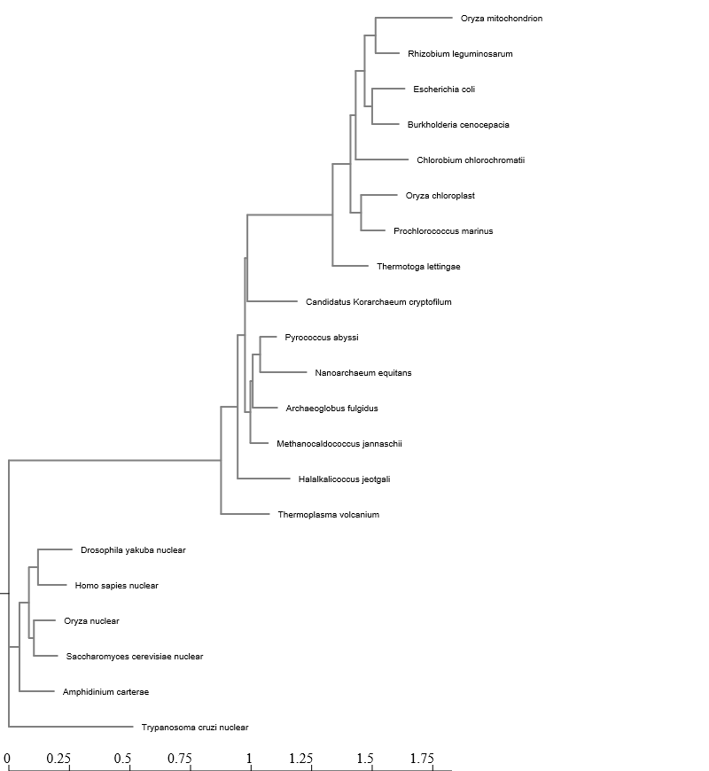

## NG Phylogeny
Doing a phylogenetic analysis involves a number of steps. First, one must assemble a group of sequences to evaluate which in our case is data from a wide representation of life. Next, one has to align the sequences so that a distance can be calculate between the sequences. These distances correlate to the relatedness of the sequences and one must  determine the relationships among the sequences. Finally, a phyologenetic analysis involves visualizing the relationships. All of the above steps except for the visualization have already been conducted. This lab walks through how to do the last step of visualization. Below is the tree that I had previously generated from the NGPhylogeny website.


 
## Visualizing and Annotating Phylogenetic Trees with R+ggtree

Going forward, I'm going to use the tree of life data as much as possible to see if I can do this kind of work on my own data set.

```{r Loading in Tree}
library(tidyverse)
library(ggtree)
library(treeio)
library(ggimage)

#BiocManager::install("ggtree")

tree <- read.tree("../data/fastree_result.tre")
tree
```

### Building Basic Trees

### CIPRES Fast Tree Result

```{r Building basic trees}
# This is convenient shorthand
ggtree(tree)

# add a scale
##ggtree(tree) + geom_treescale()

# or add the entire scale to the x axis with theme_tree2()
ggtree(tree) + theme_tree2()

#Customization
ggtree(tree, branch.length="none") #Disable scaling to produce a cladogram
ggtree(tree, branch.length="none", color="blue", size=2, linetype=3)

# create the basic plot
p <- ggtree(tree)

# add node points
p + geom_nodepoint()

# add tip points
p + geom_tippoint()

# Label the tips
p + geom_tiplab()

# Another way to find nodes
ggtree(tree) + geom_text(aes(label=node), hjust=-.3)
```

### Exercise 1

```{r Exercise 1}
ggtree(tree, layout = "slanted")+ geom_tiplab()
ggtree(tree, layout = "circular")+ geom_tiplab()
ggtree(tree, layout = "circular",  branch.length="none", color="red", size=2)+ geom_tiplab()
```

### Exercise 2

```{r Exercise 2}
p <- ggtree(tree)

p <- p + geom_nodepoint(color = "yellow", alpha = 0.5)+ geom_tippoint(color = "purple", pch = 23) + geom_tiplab(color = "purple", geom = "label")

p
```

### Tree Annotation

```{r Tree annotation}
# Internal node number
ggtree(tree) + geom_text(aes(label=node), hjust=-.3)
#Labeling Clades
ggtree(tree) + 
  geom_tiplab() + 
  geom_cladelabel(node=17, label="Some random clade", 
                  color="red2", offset=.5, align=TRUE) + 
  geom_cladelabel(node=21, label="A different clade", 
                  color="blue", offset=.5, align=TRUE) + 
  theme_tree2() + 
  theme_tree()

ggtree(tree) + 
  geom_tiplab() + 
  geom_hilight(node=17, fill="gold") + 
  geom_hilight(node=21, fill="purple")
# Connecting taxa
ggtree(tree) + 
  geom_tiplab() + 
  geom_taxalink("Oryza_chloroplast", "Oryza_nuclear", color="blue3") +
  geom_taxalink("Oryza_chloroplast", "Oryza_mitochondrion", color="orange2", curvature=-.9)

#MRCA(tree, tip=c("Oryza_chloroplast", "Oryza_mitochondrion"))
```

### Exercise 3

```{r}
tree <- read.tree("../data/tree_newick.nwk")
tree
#MRCA(tree, tip=c("B", "C")) #Node 19
#MRCA(tree, tip=c("L", "J")) #Node 23

ggtree(tree) + geom_tiplab() +
  geom_hilight(node=19, fill="gold") + 
  geom_hilight(node=23, fill="purple") +
  geom_cladelabel(node=17, label="Superclade 17", 
                  color="blue", offset=.8, align=TRUE) +
  geom_taxalink("C", "E", color="gray", linetype = 2) +
  geom_taxalink("G", "J", color="gray", linetype = 2) +
  ggtitle("Andrew's Beautiful Tree!") +
  theme_tree2()

```

### Advanced Tree Notation

```{r}
# Read the data
tree <- read.beast("../data/flu_tree_beast.tree")
# supply a most recent sampling date so you get the dates
# and add a scale bar
ggtree(tree, mrsd="2013-01-01") + 
  theme_tree2() 
# Finally, add tip labels and adjust axis
ggtree(tree, mrsd="2013-01-01") + 
  theme_tree2() + 
  geom_tiplab(align=TRUE, linesize=.5) + 
  xlim(1990, 2020)

msaplot(p=ggtree(tree), fasta="../data/flu_aasequence.fasta", window=c(150, 175)) +
  coord_polar(theta="y")
```


### Colored Tree of Life

The below tree is colored based on the various domains of life.

```{r}
ggtree(tree) + 
  geom_tiplab() + 
  geom_hilight(node=c(3,21), fill="pink", extend = 1) +
  geom_hilight(node=c(29), fill="gold") +
  geom_hilight(node=c(34), fill="green")
```


### Radial Tree of Life

```{r}
ggtree(tree, layout = "circular") + 
  geom_tiplab() + 
  geom_hilight(node=c(3,21), fill="pink", extend = 1) +
  geom_hilight(node=c(29), fill="gold") +
  geom_hilight(node=c(34), fill="green")
```


# References

Yu, Guangchuang, et al. “ggtree: an r package for visualization and annotation of phylogenetic trees with their covariates and other associated data.” Methods in Ecology and Evolution (2016) DOI:10.1111/2041-210X.12628.
