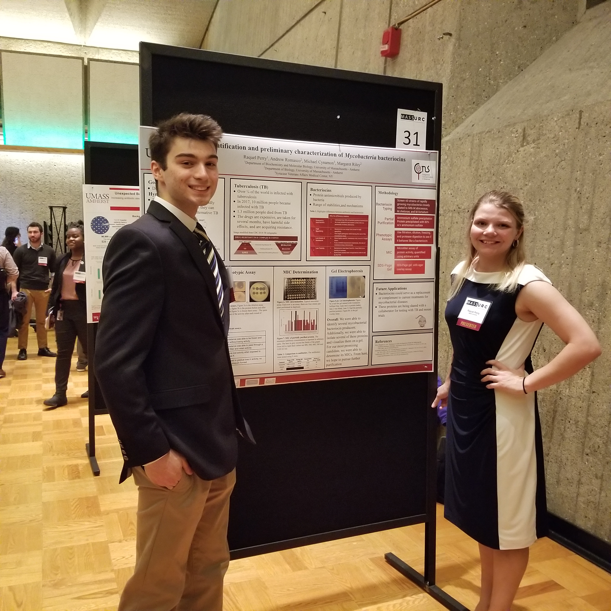

## Please remember to *VOTE*

If you are having trouble voting, or don't know if you are registered please use this link https://vote.gov/.

{width=250px,height=100px}

{width=250px,height=250px}

{width=50px,height=50px}

### Labs
*[Lab1](Lab1/lab1_AVVR.html)

*[Lab2](Lab2/lab2_AVVR.html)

*[Lab3A: Starting with Data](Lab3/lab3A_AVVR-Starting-with-Data.html)

*[Lab3B: Manipulating Data](Lab3/lab3B_AVRR-Manipulating-the-Data.html)

*[Lab4: Data Wrangling](Lab4/lab4_AVVR_Data_Wrangling.html)

*[Lab5: Data Visualization w/ GGPlot](Lab5/lab5_AVVR_Data_Visualization_with_GGPlot.html)

*[Lab5: COVID19 Data Visualization](Lab5/lab5_AVVR_COVID_Visualization.html)

*[Lab5x: Interactive Graphing! Animations too!](Lab5/lab5_AVRR_Interactive_Graphing.html)

*[Lab6: Data Maps and Interactive Graphs](Lab6/lab6_AVVR_COVID19_Data_Maps_Interactive_Graphs_and_Animations.html)

*[Lab7: Data Maps and Interactive Graphs](Lab7/Lab7: RNA-Seq workflow: gene-level exploratory analysis and differential expression.html)

*[Lab8: Sequence Alignment, Phylogenetic Analysis and Tree Visualization](Lab8/Lab-8_-Sequence-Alignment,-Phylogenetic-Analysis-and-Tree-Visualization.html)

*[Lab9: Regular Expressions in R](Lab9/Lab9-Programming-in-R---Regular-Expressions.html)

*[Lab9x: Control Structures](Lab9/Lab9x-Control-Structures.html)

*[Lab10: Population based Genomics on HTS](Lab10/lab10-Population-based-genomics-on-High-Thoroughput-Sequencing.html)

Application written in R [@RCoreTeam] using the Shiny framework [@Chang2015].

# REFERENCES
